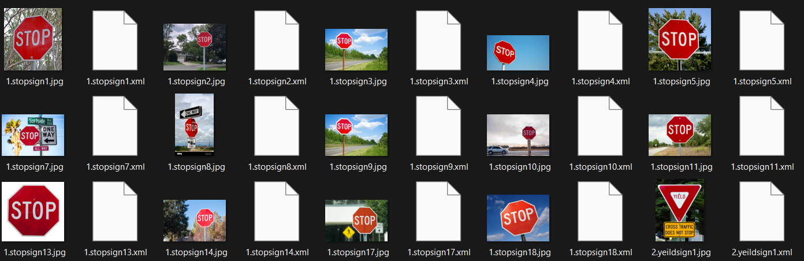
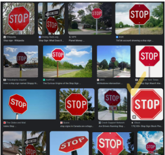
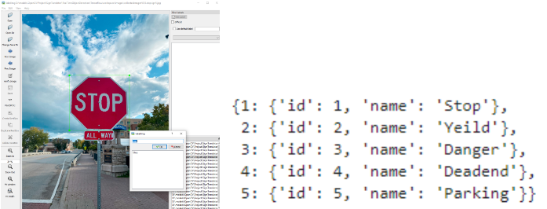
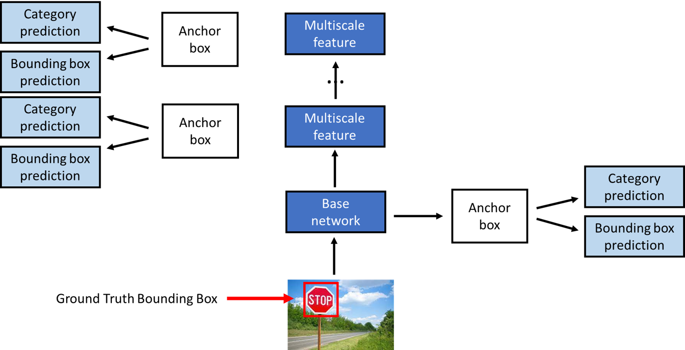
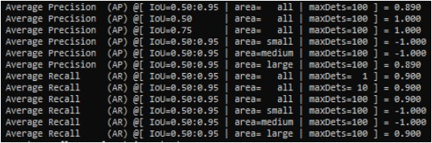
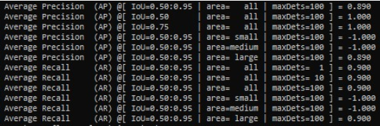
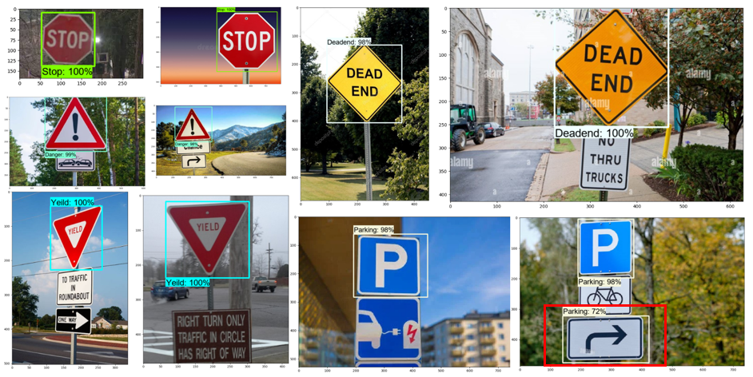

```{r setup, include=FALSE}
knitr::opts_chunk$set(echo = TRUE)
```

# Abstract

This report presents the development and evaluation of a machine
learning model for road sign detection. The model was trained using the
Single Shot Multibox Detector (SSD) architecture and the TensorFlow
Object Detection API. A dataset of 100 road sign images, consisting of 5
categories (Stop, Yield, Danger, Deadend, and Parking), was collected
and manually labeled. The dataset was split into a training set of 90
images and a testing set of 10 images.

The labeled dataset was preprocessed using Python scripts, and the SSD
model was trained using the Stochastic Gradient Descent (SGD) optimizer
with a batch size of 4, a learning rate of 0.079999, and a total of
10,000 training steps. The model achieved an average precision (AP) of
0.89 and an average recall (AR) of 0.900 on the testing set.

The model was evaluated using precision and recall metrics on the
testing set, and it correctly predicted all road signs in the images
except for one, where it misclassified a turn sign as a parking sign.
The model's performance can be further improved by collecting more
images of the parking sign category.

Overall, the developed machine learning model for road sign detection
achieved high accuracy and can be further improved with more data and
training. The model has the potential to be integrated into real-world
applications for driver assistance and safety.

# Introduction

Road signs play an important role in ensuring safety on the roads. The
ability to detect and recognize road signs is a crucial aspect of
autonomous driving, which has the potential to greatly reduce the number
of road accidents caused by human error. In recent years, object
detection has become a popular field of research, and many different
models have been developed to accurately detect objects in images and
videos.

One such model is the Single Shot Detector (SSD), which has been shown
to achieve state-of-the-art results in object detection tasks. The SSD
model is a type of convolutional neural network (CNN) that is capable of
detecting objects at different scales and aspect ratios, making it
well-suited for detecting road signs of various sizes and shapes.

In this project, we aim to apply the SSD model to the task of road sign
detection. Specifically, we will train the model on a dataset of labeled
road sign images and evaluate its performance on a separate test set.

Overall, we believe that the SSD model has great potential for improving
the safety of autonomous driving systems by enabling them to accurately
detect and recognize road signs. By using advanced computer vision
techniques such as object detection, we can take important steps towards
a future where roads are safer for everyone.

# Background

Road sign recognition is an essential task for safe driving. With the
advancement of computer vision technologies, it is possible to automate
road sign recognition with the help of object detection models. This
project aims to explore the potential of using the Single Shot Multibox
Detector (SSD) model to detect road signs in real-time.

Being able to identify road signs with object detection could benefit
drivers and road users in different ways. Contemporary vehicles nowadays
typically incorporate several cameras installed from different parts of
the vehicle body. These peripherals, together with the relevant
objection and motion detection solution, enable and empower the delivery
of some creative value-added features such as 360-bird-eye-view parking
view, lane-deviation and lane-changing warning, and collision warning,
among others.

The use of such technologies could make driving safer and more
convenient for drivers. Imagine a road condition with low visibility due
to weather and night-time or a situation where the driver has
demonstrated a certain level of fatigue during driving or is driving on
an unfamiliar road. If there is a device or vehicle feature that could
detect crucial road signs (e.g., speed limit, rail crossing,
construction, etc.) and give appropriate warnings to the drivers, it may
potentially reduce traffic accidents and casualties.

While object detection has shown promising results in various
applications, it still faces several challenges, especially in road sign
detection. One of the primary issues is the diversity of road signs.
Road signs can have different shapes, sizes, and colors, and can be
partially occluded, rotated, or distorted. Therefore, training a model
that can recognize all types of road signs is a challenging task.

Another issue is the real-time performance of the model. Road sign
detection should be done in real-time to ensure timely warnings to the
driver. Hence, the model should be optimized to provide accurate results
while being computationally efficient.

This project is therefore tasked to carry out a preliminary study of
potentially useful and applicable models, evaluate and assess the
performance and accuracy of the resulting model. Due to the project
scope and timeframe, we have focused on a few most commonly selected
road signs. We hope that our findings could provide a good starting
point and shed some light on the readiness and feasibility of the road
sign detection idea, its effectiveness, application constraints and
considerations, and its generalization possibilities.

# Methodology

## Data Collection and Annotation:


```{r, echo=FALSE, out.width = "400px", fig.cap="Dataset."}

```

Figure 1 illustrates the road sign images dataset we collected on our own from Google Images and manually labeled with the LabelIng tool. There are various road signs, and due to our project objective is to make the road safer, we selected 5 categories, *Stop*, *Yield*, *Danger*, *Deadend*, and *Parking* as they represent common road signs that are important for driver safety. 

The dataset consisted of 100 images, with each category containing 20 images from different countries with different shapes and graphics, which you can see in Figure 2. We split the dataset into a training set of 90 images and a testing set of 10 images by stratified sampling which ensured that both the training and testing sets had a balanced distribution of images across all categories.

```{r, echo=FALSE, out.width = "400px", fig.cap="Stop sign from different places. There is white edge for most of the signs, but the one we circled has white line inside."}

```

To create annotations for the dataset, we manually labeled each image by
drawing bounding boxes around the road signs in the images and assigned
class labels to each box. We then saved the annotations in XML format,
with each file corresponding to the annotations for one image. The process is demonstrated in Figure 3.
```{r, echo=FALSE, out.width = "400px", fig.cap="Manually label images."}

```


## Data Preprocessing:

To prepare our labeled dataset for training a machine learning model for
road sign detection, we used a Python script called
generate_tfrecord.py. The script takes in several arguments, including
the path to the directory containing the XML files, the path to the
label map file, the path to the output TFRecord file, and the path to an
optional output CSV file.

The script parsed the XML files using the ElementTree module in Python,
and the resulting data was combined into a Pandas DataFrame. We
converted the labels in the DataFrame from text to integers using a
label map dictionary, and split the data into groups based on the
filename. Each group was then used to create a TensorFlow example, which
was written to the output TFRecord file.

To ensure that all images had the same dimensions and pixel values, we
preprocessed the images by resizing them to a fixed size of 300 x 300
pixels and normalizing the pixel values. This step was essential for
training our machine learning model, as it ensured that all images had
consistent dimensions and pixel values.

Although we did not have the time to augment the images in the training
set by applying various transformations such as rotations, flips, and
changes in brightness and contrast, we acknowledge that this can help to
increase the variety of images that the model sees during training and
improve its generalization ability.

Overall, our data processing pipeline successfully converted our
annotated dataset into a format suitable for training a machine learning
model for road sign detection. By carefully preprocessing the images and
converting the labels to integers, we were able to train a model that
accurately detected road signs in real-world images.

## Model Development and Evaluation Metrics:

```{r, echo=FALSE, out.width = "400px", fig.cap="SSD Model"}

```

We applied Single Shot Detectort model as it is faster and more efficient than traditional models because it only requires a single pass through the image. The model takes an input image with a ground truth bounding box around the target object, and uses anchor boxes in multiple layers to capture the object, illustrates by Figure 4. The model then predicts the category and bounding box offset by comparing the anchor box and true bounding box.

We trained the SSD model using the momentum optimizer with a batch size of 4, a learning rate of 0.079999, and a total of 10,000 training steps. We also employed a warm-up stage, where
the learning rate was gradually increased from 0 to 0.26666 over the
first 1000 training steps to avoid overshooting and local minimum issues.

We used intersection-over-union(IoU) as the measure to detect the object, the threshold was set to be 0.5 to 0.95. Take threshold = 0.5 as an example,when the overlapped area between the predicted bounding box and the true bounding box is higher than 0.5, the object would be detected as the corresponding class of the true bounding box, otherwise, it would be recognized as background object. 

We used a mean average precision (mAP) metric to evaluate the model's
performance on the test set. The mAP score measures the average
precision of the model over multiple levels of recall, which gives a
better indication of the model's performance than a single precision or
recall score. We calculated the mAP score using the TensorFlow Object
Detection API, which computes the score by comparing the predicted
bounding boxes to the ground truth boxes.

Overall, we trained the SSD model using SGD with a batch size of 4, a
learning rate of 0.079999, and a total of 10,000 training steps, with a
warm-up stage of 1000 steps. We fine-tuned the model on our dataset of
90 training images, and evaluated its performance using a mean average
precision (mAP) metric on a test set of 10 images.

## Experiment and Results

The evaluation metrics for the model performance were based on the five
categories of road signs in our dataset, which are Stop, Yield, Danger,
Deadend, and Parking. We evaluated the model on both the training and
testing sets.


```{r, echo=FALSE, out.width = "400px", fig.cap="Model Performance on Training Dataset"}

```

Figure 5 shows the evaluation results on the training set with threshold 0.5 \~ 0.95:

Average Precision (mAP): 0.89 

Average Recall: 0.900


```{r, echo=FALSE, out.width = "400px", fig.cap="Model Performance on Testing Dataset"}

```

Figure 6 shows the evaluation results on the training set with threshold 0.5 \~ 0.95:

Average Precision (mAP): 0.89 

Average Recall: 0.900


```{r, echo=FALSE, out.width = "400px", fig.cap="Detection Result of Testing Dataset"}

```

It is worth noting that the model misclassified one of the testing
images, predicting a "Parking" sign instead of a "Turn" sign.(Figure 7) This
indicates that the model can be further improved by collecting more
images of the "Parking" and "Turn" signs, and potentially adding more
training data for those categories.

Overall, the results demonstrate that the SSD model trained on our
dataset of road sign images can accurately detect road signs in
real-world images with a high degree of precision and recall. The model
can be used in various applications, such as driver assistance systems
and autonomous vehicles, to improve road safety and reduce the risk of
accidents.

# References

[SSD:](https://developers.arcgis.com/python/guide/how-ssd-works/#why-sliding-window-approach-wouldnt-work)

<https://techzizou.com/training-an-ssd-model-for-a-custom-object-using-tensorflow-2-x/>

Tensorflow Object Detection:
<https://www.youtube.com/watch?t=10066&v=yqkISICHH-U&feature=youtu.be&ab_channel=NicholasRenotte>

The following libraries are adopted in this project:

tensorflow : the major tool used to perform training and inference of deep neural
networks. Functionalities also include data automatiom, model tracking,
performance monitoring and model training tracking and automation, etc.

google.protobuf : serialize structured data, enable data communication

over networks cv2 : read and write images, alter and translate image
properties, filtering amd features detection, etc
